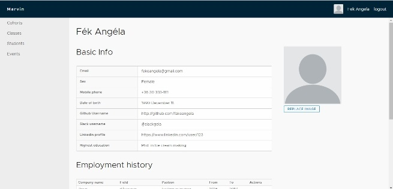

[This is the syllabus link](https://github.com/greenfox-academy/rabbit-syllabus)

<h1>🐰 Foundation</h1>

Week 1 - HTML, CSS 
Week 2 - Programming Basics in Python 
Week 3 - File IO and drawing in Python 
Week 4 - Object Oriented Programming & Unit Testing 
Week 5 - RPG Game 

<h1>🐰🐰 Orientation</h1> 

Week 6 - Advanced CSS 
Week 7 - Getting Started with JavaScript 
Week 8 - Frontend, REST 
Week 9 - Testing, NodeJS, SQL 
Week 10 - Prototype, closures / Musicplayer 
Orientation Exam 

<h1>🐰🐰🐰 Project Phase</h1> 
Húli project - Marvin frontend project in Angular 5 (https://github.com/greenfox-academy/HuliChat) 

FedEx day - HúliChat project(Angular, FireBase, Flask) (https://github.com/greenfox-academy/huli-marvin-frontend) 

Final Exam 
